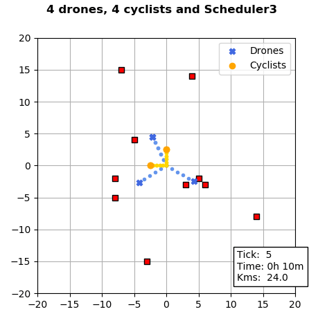

Deliveries Challenge
=========================
This implements the solution for the coding challenge about a service that
provides local deliveries using either drones or cyclists.

Dependencies
------------
This project was developed and tested with the versions listed below.

| Name          | Version       |
| ------------- |:-------------:|
| Python        | 3.7.2         |
| Numpy         | 1.16.1        |
| Matplotlib    | 3.0.2         |
| Nosetests     | 1.3.7         |

*Nosetests is just needed to run the tests.*

Description
-----------
The main components of this project are the **schedulers**.
* `Scheduler`: This is the base abstract class that defines the interface
that a scheduler should implement:
  * `get_route_for_drone()`: Returns a route for a drone. It contains a single package.
  * `get_route_for_cyclist()`: Returns a route for a cyclist.
* `Scheduler1`: Very basic scheduler based on queuing deliveries.
* `Scheduler2`: Distributes all packages in the deliveries in two queues, one for the
   drones and other for the cyclists. It also implements packages batching for the
   cyclists.
* `Scheduler3`: In addition to the previous approach, this scheduler implements the
   Sweep Algorithm to optimize the routes given to the cyclists. This consists on sorting
   the packages using a rotating ray centered at the depot, and then solving the Travelling
   Salesman Problem for every batch. It also adds a mechanism to balance the queues when
   the number of drones is a bottleneck.


Run the tests
-------------
Some tests are provided with this project to verify the correct functioning of
 the `Scheduler3`.
```
nosetests -v
```
You should be able to see an output like this:
```
Packages from several deliveries can be given to a cyclist. ... ok
Cyclists can batch packages up to 50 kg. ... ok
Cyclists can batch packages up o 4 packages. ... ok
Cyclists are given an optimal route. ... ok
A package of weight equal to 50 kg can be given to a cyclist. ... ok
A package of weight equal to 5 kg can be given to a drone. ... ok
A package of weight greater than 50 kg cannot be given to a cyclist. ... ok
A package of weight greater than 5 kg can be given to a cyclist. ... ok
A package of weight less than 5 kg can be given to a cyclist. ... ok
Several packages from a delivery can be given to a cyclist. ... ok
All packages from a delivery can be given to drones. ... ok
A package from a delivery can be given to a drone. ... ok
A package of weight equal to 5 kg can be given to a drone. ... ok
A package of weight greater than 5 kg cannot be given to a drone. ... ok
A package of weight less than 5 kg can be given to a drone. ... ok

----------------------------------------------------------------------
Ran 15 tests in 0.022s

OK
```

Run the simulation
------------------
As part of this project a `Simulation` class is provided, not only to consume and exercise
the schedulers but also to have a visual an intuitive way to see the results.

To run a simulation with 1 drone and 1 cyclist, using the `Scheduler1` for the deliveries given
as example you can execute the following command:
```
./run 1 1 scheduler1 < sample_inputs/deliveries0.txt
```

For more details you can see the help card.


Generate deliveries
-------------------
The input deliveries are read via `stdin`. Along with this project it is provided a script
that may come handy to generate random deliveries samples.

To generate 10 deliveries whose destinations are in the range [-15, 15] you can run this:
```
./generate_deliveries 10 15
```

And then you could simulate that:
```
./run 4 4 schedule3 < deliveries.txt
```

